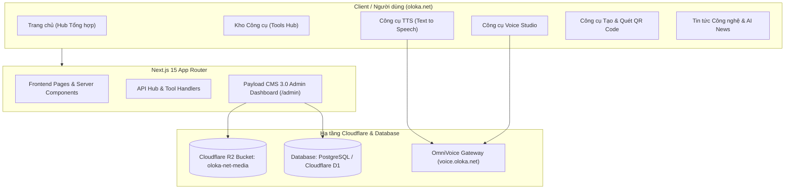

# 🌐 Kế hoạch triển khai Website Oloka.net (AI & Tech Hub + Payload CMS)

> **Mục tiêu**: Xây dựng nền tảng web **oloka.net** đóng vai trò là Hub tổng hợp các công cụ AI / tiện ích thực tiễn (TTS, Voice, QR Code Generator & Scanner...) kết hợp Tạp chí Tin tức Công nghệ & AI News hàng đầu. Hệ thống quản trị nội dung chạy trên **Payload CMS 3.0**, lưu trữ media trên **Cloudflare R2**, và toàn bộ hệ thống được triển khai trên hạ tầng **Cloudflare**.

---

## 🎨 1. Phân tích Nhận diện Thương hiệu (Brand Identity)

Từ file logo gốc: `H:\My Drive\Sync Folder\Personal\0. OLOKA\SVG\Asset 5Oloka_new.svg`

### 1.1. Bảng màu chủ đạo (Dual-Tone Palette)
* **Tone 1: Sky Cyan / Electric Blue (`#46C7F0`)**
  * *Ý nghĩa*: Công nghệ, Trí tuệ Nhân tạo, Tương lai, Sự minh bạch và Đột phá.
  * *Ứng dụng*: Primary buttons, Tech badge, Glowing accents, Link hover, Biểu tượng chính.
* **Tone 2: Coral Tangerine / Warm Orange (`#F47D59`)**
  * *Ý nghĩa*: Sáng tạo, Năng động, Thân thiện với con người, Tính ứng dụng cao.
  * *Ứng dụng*: Secondary CTA, Hot/Breaking News tags, Voice/Audio waveforms, Highlight markers.
* **Gradient Thương hiệu (Brand Signature Gradient)**:
  * `linear-gradient(135deg, #46C7F0 0%, #F47D59 100%)`
  * Dùng cho: Header logo glow, Banner chiến dịch, Viền card nổi bật, QR Code gradient style.

### 1.2. Màu nền & Typography
* **Dark Mode (Mặc định)**: Nền tối sâu `#0A0E17` (Deep Obsidian) kết hợp `#111827` (Card Surface) và `#1E293B` (Border) tạo hiệu ứng Cyber-Tech cao cấp.
* **Light Mode (Tùy chọn)**: Nền `#F8FAFC` (Clean Slate), Card `#FFFFFF`, Chữ `#0F172A`.
* **Font**: *Plus Jakarta Sans* / *Inter* (Hỗ trợ tiếng Việt hoàn hảo, hiện đại, rõ nét).

---

## 🏗️ 2. Khảo sát Hiện trạng & Tài nguyên Hạ tầng

Qua quá trình kiểm tra môi trường máy và Cloudflare:
1. **Domain**: `oloka.net` đã được cấu hình trên Cloudflare.
   * Đang có subdomain `voice.oloka.net` chạy dự án `omnivoice-gateway`.
2. **Cloudflare Storage (R2)**:
   * Đã có sẵn 2 bucket trên tài khoản: `oloka-net-media` và `oloka-media` (Tạo ngày 07/10/2026).
   * Sẽ kết nối trực tiếp `oloka-net-media` làm Media Storage cho Payload CMS (`@payloadcms/storage-s3`).
3. **Môi trường phát triển**:
   * Node.js: `v24.13.0`
   * Package Manager: `pnpm 11.18.0` / `npm 11.14.1`
   * Wrangler CLI: `4.148.0`
4. **Cơ sở dữ liệu cho Payload CMS trên Cloudflare**:
   * **Phương án 1 (Khuyên dùng)**: **Neon / Supabase PostgreSQL** kết nối qua Cloudflare Hyperdrive / Node pooling. (Ưu điểm: Payload CMS Postgres adapter cực kỳ ổn định, hỗ trợ full text search, quan hệ dữ liệu phức tạp, không bị giới hạn kích thước Worker).
   * **Phương án 2**: **Cloudflare D1 (SQLite Edge)** qua `@payloadcms/db-d1-sqlite`. *(Lưu ý: API Token hiện tại cần bổ sung quyền D1 Permissions trong Cloudflare Dashboard nếu muốn quản lý D1 hoàn toàn qua CLI)*.

---

## 🧩 3. Kiến trúc Tính năng Hệ thống

### 3.1. Phân hệ Công cụ Tiện ích (Tools Suite)
1. **TTS (Text to Speech Studio) (`/tools/tts`)**:
   * Chuyển đổi văn bản thành giọng đọc đa ngôn ngữ (tiếng Việt, tiếng Anh,...).
   * Tùy chỉnh tốc độ (speed), cao độ (pitch), lựa chọn giọng đọc theo giới tính/vùng miền.
   * Trình phát âm thanh tích hợp sóng âm (Waveform visualizer), tải file MP3/WAV.
   * Liên kết với API `voice.oloka.net` (OmniVoice Gateway) và fallback Web Speech API trực tiếp trên trình duyệt.
2. **AI Voice Studio (`/tools/voice`)**:
   * Ghi âm giọng nói trực tiếp, khử nhiễu, chuyển đổi định dạng âm thanh.
   * Trình thử nghiệm mẫu giọng (Voice Preview & Showcase).
3. **QR Code Studio 2-Tone (`/tools/qr-code`)**:
   * Tạo QR Code đa dạng loại: URL, Văn bản, Mật khẩu WiFi, Danh thiếp (vCard), Mạng xã hội.
   * **Tùy biến thẩm mỹ cao cấp**:
     * Áp dụng phối màu 2 tone đặc trưng của Oloka (`#46C7F0` & `#F47D59`).
     * Tùy chọn chèn Logo Oloka hoặc Logo cá nhân vào chính giữa mã QR.
     * Tùy chọn bo góc điểm ảnh (Dots style, Corner square style).
   * Tải về định dạng ảnh sắc nét (PNG độ phân giải cao, SVG vector).
   * Tích hợp tính năng Quét mã QR (QR Scanner) qua camera hoặc upload ảnh.
4. **Hệ thống Mở rộng Công cụ (Extensible Registry)**:
   * Danh mục phân loại: AI Generative, Audio/Voice, Utilities, Dev Tools, Graphics.
   * Mỗi công cụ có trang chi tiết chuẩn SEO (Schema Markup, FAQ, Hướng dẫn sử dụng).

### 3.2. Phân hệ Tin tức Công nghệ & AI News (`/news`)
1. **Danh mục tin tức chuyên sâu**:
   * *Tin tức AI (AI News)*: Cập nhật mô hình mới, đột phá LLM, thị trường AI.
   * *Xu hướng Công nghệ (Tech Trends)*: Phần cứng, phần mềm, thiết bị di động, điện toán đám mây.
   * *Thủ thuật & Hướng dẫn (Tutorials)*: Hướng dẫn ứng dụng AI vào công việc thực tế.
   * *Đánh giá Công cụ (Tool Reviews)*: So sánh, đánh giá chuyên sâu các ứng dụng AI.
2. **Tính năng bài viết**:
   * Trình soạn thảo văn bản giàu định dạng (Lexical Rich Text của Payload CMS).
   * Tối ưu SEO tự động (OpenGraph card, Twitter card, Schema Article, Meta tags).
   * Ticker tin tức nhanh (Breaking News Ticker) ngay trên trang chủ.
   * Tìm kiếm bài viết tức thì và lọc theo chuyên mục/thẻ tag.

### 3.3. Phân hệ Quản trị Payload CMS 3.0 (`/admin`)
* **Collections (Bộ sưu tập dữ liệu)**:
  * `Articles`: Quản lý bài viết tin tức (Tiêu đề, Slug, Tóm tắt, Nội dung, Ảnh bìa, Tác giả, Chuyên mục, Trạng thái xuất bản).
  * `Categories`: Danh mục bài viết và công cụ (Tên, Slug, Mô tả, Màu sắc nhận diện).
  * `Tools`: Danh mục các công cụ trên hệ thống (Tên, Slug, Icon, Mô tả ngắn, Link trực tiếp, Huy hiệu: Hot/New/Free).
  * `Media`: Quản lý tệp tải lên (hình ảnh, audio), đồng bộ tự động lên Cloudflare R2 bucket `oloka-net-media`.
  * `Users`: Phân quyền người dùng (Admin, Editor, Author).
* **Globals (Cấu hình toàn trang)**:
  * `SiteSettings`: Tên trang, Favicon, Logo SVG, Thông tin liên hệ, Mạng xã hội, Banner thông báo toàn site.

---

## 📅 4. Lộ trình Triển khai (Step-by-Step Implementation Roadmap)

### Giai đoạn 1: Khởi tạo Project & Cấu hình Nhận diện (Phase 1)
- [ ] Khởi tạo dự án Next.js 15 + Payload CMS 3.0 tại thư mục `C:\Users\admin\.gemini\antigravity\scratch\oloka-net`.
- [ ] Import logo SVG gốc và cấu hình Tailwind CSS Design System với 2 tone màu `#46C7F0` và `#F47D59`.
- [ ] Xây dựng Layout tổng thể: Header thương hiệu (Logo Oloka, Navigation, Menu chuyển Dark/Light mode), Footer hiện đại.

### Giai đoạn 2: Xây dựng Bộ Công cụ Tương tác (Phase 2 - Tools Engine)
- [ ] Phát triển công cụ **QR Code Studio** hoàn chỉnh (Tạo QR theo 2 tone Oloka, chèn logo, tải PNG/SVG, trình quét QR).
- [ ] Phát triển công cụ **TTS (Text to Speech)** kết nối Audio Engine & tích hợp tùy chọn giọng đọc.
- [ ] Phát triển công cụ **Voice Studio** (Ghi âm, thử giọng, xem trước các model âm thanh).
- [ ] Xây dựng trang danh mục `/tools` với bộ lọc tìm kiếm theo thể loại.

### Giai đoạn 3: Cấu hình Payload CMS 3.0 & Tin tức (Phase 3 - CMS & News)
- [ ] Cấu hình Collections Payload CMS (`Articles`, `Categories`, `Tools`, `Media`, `Users`).
- [ ] Kết nối Media Storage với Cloudflare R2 bucket `oloka-net-media`.
- [ ] Xây dựng trang giao diện tin tức `/news` và trang chi tiết bài viết `/news/[slug]` chuẩn SEO.
- [ ] Tạo dữ liệu mẫu khởi tạo (Bài viết tin tức AI mẫu, danh sách công cụ mặc định).

### Giai đoạn 4: Tích hợp Cloudflare & Sẵn sàng Chạy Tên miền oloka.net (Phase 4)
- [ ] Cấu hình adapter triển khai Cloudflare (`@opennextjs/cloudflare` hoặc Cloudflare Pages / Workers).
- [ ] Kiểm tra kết nối Database & R2 trên Cloudflare.
- [ ] Build & Test toàn diện hiệu năng (Lighthouse score, Responsive mobile/tablet/desktop).
- [ ] Gửi báo cáo hoàn tất và hướng dẫn cấu hình DNS Cloudflare trỏ domain `oloka.net`.

---

## ❓ Câu hỏi xác nhận trước khi bắt đầu
1. **Lựa chọn Database cho Payload CMS**:
   * Bạn muốn dùng **Cloudflare D1** (SQLite tích hợp sẵn trên Cloudflare) hay dùng **PostgreSQL** (qua Supabase/Neon - cực kỳ mượt mà với Payload)?
2. **Kích hoạt triển khai**:
   * Bạn có muốn tôi tiến hành khởi tạo source code dự án tại `C:\Users\admin\.gemini\antigravity\scratch\oloka-net` ngay bây giờ không?
